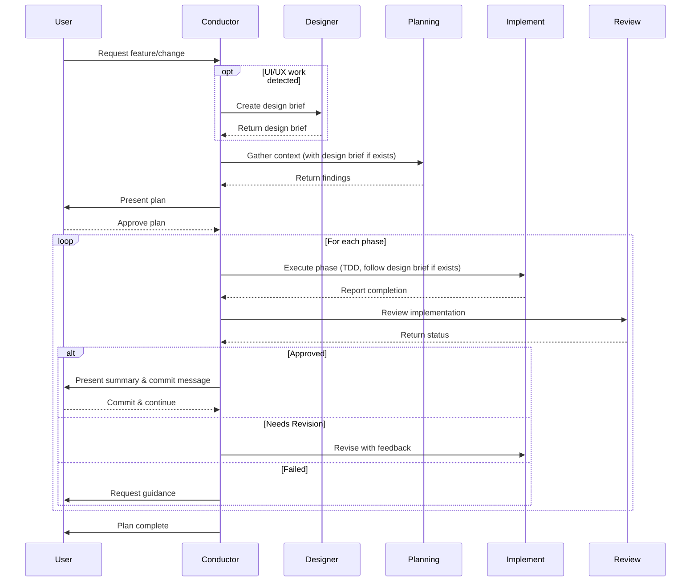

# GitHub Copilot Orchestra

> **A multi-agent orchestration system for structured, test-driven software development with AI assistance**

## What is GitHub Copilot Orchestra?

The "GitHub Copilot Orchestra" pattern transformed how I build with AI agents. Instead of juggling context and constantly switching modes, the Orchestra pattern provides a structured workflow that coordinates specialized AI subagents through a complete AI development cycle for adding a feature or making a change: planning → implementation → review → commit.

The system solves a critical challenge in AI-assisted development: maintaining code quality and test coverage while moving quickly. By enforcing Test-Driven Development (TDD) conventions and implementing quality gates at every phase, you get the speed of AI coding combined with best practices in software engineering.

## Key Features

- **🎭 Multi-Agent Workflow** - Conductor agent orchestrates specialized Planning, Implementation, and Code Review subagents, each optimized for their specific role.
- **✅ TDD Enforcement** - Strict Test Driven Development: writing failing tests, seeing them fail, writing minimal code to pass, and verifying success before proceeding.
- **🔍 Quality Gates** - Automated code review after each phase ensures standards are met before moving forward.
- **📋 Documentation Trail** - Comprehensive plan files and phase completion records create an audit trail for reviewing all work completed.
- **⏸️ Mandatory Pause Points** - Built-in stops for plan approval and phase commits keep you in control of the development process.
- **🔄 Iterative Cycles** - Each implementation phase follows the complete cycle: implement → review → commit before proceeding to the next phase.
- **💎 Keeps Context Concise** - The majority of the work is done in dedicated subagents, each with its own context window and dedciated prompt. This helps reduce hallucinations as the context window fills up.

## Architecture Overview

The Orchestra system consists of five specialized agents:

### Conductor Agent
- `Conductor.agent.md` - Main orchestration agent that manages the complete development cycle.
    - Coordinates Designer, Planning, Implementation, and Code Review subagents.
    - Generates the plan to be followed.
    - Handles user interactions and mandatory pause points.
    - Enforces the Design (when needed) → Planning → Implementation → Review → Commit cycle.
    - Uses Claude Sonnet 4.5 by default.

### Designer Subagent
- **`designer-subagent.agent.md`** - UI/UX design specialist.
    - Analyzes UI/UX requirements from user requests.
    - Researches existing UI frameworks in the project or user-suggested frameworks.
    - Creates comprehensive design briefs in JSONC format.
    - Provides design guidance (colors, typography, components, layouts, interactions).
    - Does NOT implement code - only provides design specifications.
    - Avoids gradients and emoji unless explicitly requested.
    - Uses Claude Sonnet 4.5 by default.

### Planning Subagent
- **`planning-subagent.agent.md`** - Research and context gathering specialist.
    - Analyzes codebase structure and patterns.
    - Identifies relevant files and functions.
    - References design briefs when available.
    - Returns structured findings to inform plan creation.
    - Uses Claude Sonnet 4.5 by default.

### Implementation Subagent
- **`implement-subagent.agent.md`** - Implementation specialist following TDD conventions.
    - Executes individual phases of the development plan.
    - Follows design brief guidance for UI/UX implementations.
    - Writes failing tests first, then minimal code to pass.
    - Works autonomously within phase boundaries.
    - Uses Claude Haiku 4.5 by default for premium request efficiency.

### Code Review Subagent
- **`code-review-subagent.agent.md`** - Quality assurance specialist.
    - Reviews uncommitted code changes using git to identify new code.
    - Validates test coverage and code quality.
    - Returns review results back to Conductor (`APPROVED/NEEDS_REVISION/FAILED`).
    - Uses Claude Sonnet 4.5 by default.

## Prerequisites

Before using the GitHub Copilot Orchestra, ensure you have:

- **VS Code Insiders** - Required for the custom chat modes feature that enables subagents and handing tasks off to them.
    - Download from: https://code.visualstudio.com/insiders/

- **GitHub Copilot Subscription** - Active subscription required for AI-powered agents
    - Individual or Business plan
    - GitHub Copilot Chat extension installed and enabled

- **Git** - Version control is integral to the workflow
    - Used for commit workflow at end of each phase
    - Recommended: Basic familiarity with git commands

## Installation

### Initial Setup

1. **Clone or Download the Repository**
   ```bash
   git clone https://github.com/ShepAlderson/copilot-orchestra.git
   cd copilot-orchestra
   ```
   
   Alternatively, download the repository as a ZIP file and extract it to your desired location or just copy the contents of the agent files from the browser.

2. **Verify Prerequisites**
    - Ensure the latest VSCode Insiders is installed and running.
    - Confirm the GitHub Copilot Chat extension is active (check the chat icon in the sidebar).
    - Verify your workspace is a git repository (run `git status` to confirm)
        - If not, you can use `git init` if you have git installed.

### Setup Custom Agents

The GitHub Copilot Orchestra uses custom chat modes in VSCode Insiders to enable the multi-agent workflow. Each `.agent.md` file defines a specialized AI agent.

1. **Open VSCode Insiders** in your workspace directory
    ```bash
    cd /path/to/your/project
    code-insiders .
    ```

2. **Locate Agent Files** - The repository includes five `.agent.md` files in the root directory:
    - `Conductor.agent.md`
    - `designer-subagent.agent.md`
    - `planning-subagent.agent.md`
    - `implement-subagent.agent.md`
    - `code-review-subagent.agent.md`

3. **Install the agent files**
    - **Copy the `.agent.md` files to your project's root directory**
        - Great for sharing among a team.
        - Scoped to the individual project.
    - **Install the custom agents in your User Data for use in all workspaces**
        - Allows the custom agents to work in any project you open with VSCode Insiders.
        - Copy files to the User Data location:
            - Something like `/Users/username/Library/Application Support/Code - Insiders/User/prompts` on Mac, or the equivalent on your system
        - **OR:**
        - Manual Setup Process:
            - Click the chat mode dropdown at the bottom of the copilot chat.
            - Click "Configure Custom Agents".
            - Click "Create new custom agent" in the command dropdown at the top of VSCode.
            - Select "User Data"
            - Type the name of the file you're setting up. i.e.:
                - Conductor
                - designer-subagent
                - planning-subagent
                - implement-subagent
                - code-review-subagent
            - Copy and paste the context of the agent file from this repo into the file that opens in VSCode.

4. Create the Plans Directory
    - The Conductor agent generates documentation files to track progress. Create the `plans/` directory (or the Conductor will make it when it writes out the first plan file):

        ```bash
        mkdir plans
        ```
    - This directory will store:
        - Core task plan documents (`<task-name>-plan.md`)
        - Phase completion summaries (`<task-name>-phase-<N>-complete.md`)
        - Final task completion summaries (`<task-name>-complete.md`)

**No Additional Configuration Required** - The agents will appear in the GitHub Copilot Chat interface automatically.

## Using the Conductor Agent

Once setup is complete, you can start using the Conductor agent:

**Via Chat Mode Dropdown**:
- Open GitHub Copilot Chat
- Click the agent dropdown at the bottom of the chat panel
- Select "Conductor" from the list of available modes

## How It Works

The Conductor agent follows a strict multi-stage cycle for every development task. For UI/UX work, it includes a design phase:

### 0. Design Phase (when UI/UX work is detected)
- **UI/UX Detection** - `Conductor` analyzes the request for UI/UX requirements (new pages, components, layouts, styling, user interactions).
- **Design Brief Creation** - `Conductor` invokes the `designer-subagent` to:
    - Research existing UI frameworks in the project (Bootstrap, Tailwind, Material UI, etc.).
    - Analyze the user's design preferences or use suggested frameworks.
    - Create a comprehensive design brief in JSONC format.
- **Design Documentation** - Design brief is saved to `plans/<task-name>/<task-name>-design-brief.jsonc`.
- **Design Guidance** - The brief includes colors, typography, spacing, component structures, layouts, interactions, and accessibility considerations.
- **No Code Changes** - Designer provides specifications only; implementation happens in later phases.

### 1. Planning Phase
- **User Request** - You describe what you want to build or change.
- **Delegates Research** - `Conductor` invokes the `planning-subagent` to gather comprehensive context about your codebase.
- **Design Brief Reference** - If a design brief exists, `planning-subagent` includes it in research findings.
- **Plan Creation** - `Conductor` drafts a multi-phase plan (typically 3-10 phases) with specific objectives, files to modify, and tests to write. References design brief if applicable.
- **Plan Approval** - `Conductor` stops, allowing you review and approve the plan before any implementation begins.
- **Plan Documentation** - Approved plan is saved to `plans/<task-name>/<task-name>-plan.md`.

### 2. Implementation Phase (repeated per plan phase)
- **Delegates Implementation** - `Conductor` invokes the `implement-subagent` with the specific phase objective and requirements.
- **Design Brief Reference** - If a design brief exists, `implement-subagent` follows its guidance for UI/UX work (framework classes, colors, typography, component structures).
- **TDD Execution** - `implement-subagent` follows strict Test-Driven Development:
    - Writes failing tests first.
    - Run tests to confirm they fail.
    - Writes minimal code to make the tests pass.
    - Run tests to verify they pass.
    - Apply linting and formatting.
- **Phase Summary** - `implement-subagent` reports completion back to the `Conductor`.

### 3. Review Phase (repeated per plan phase)
- **Quality Check** - `Conductor` invokes the `code-review-subagent` to validate the implementation.
- **Review Analysis** - `code-review-subagent` examines:
    - Test coverage and correctness.
    - Code quality and best practices.
    - Adherence to phase objectives.
- **Status Decision**:
    - Returns to `Conductor` with:
        - `APPROVED` - Proceed to commit step.
        - `NEEDS_REVISION` - Return to implementation with specific feedback.
        - `FAILED` - Stop and consult user for guidance.

### 4. Commit Phase (repeated per plan phase)
- **Phase Summary** - `Conductor` presents what was accomplished, to the user.
- **Documentation** - Phase completion file is saved to `plans/<task-name>-phase-<N>-complete.md`.
- **Commit Message** - `Conductor` generates a properly formatted git commit message.
- **MANDATORY STOP** - User makes the git commit and confirm readiness to continue.

**The Implement -> Review -> Commit cycle repeats** for each phase until the entire plan is complete, then the `Conductor` generates a final plan completion report.

### Agent Interaction Flow



## Usage Example

Here's a realistic scenario demonstrating the complete workflow:

### Scenario: Adding User Authentication

**Initial Request:**
```
I need to add JWT-based user authentication to my Express API. 
Users should be able to register, login, and access protected routes.
```

**1. Planning Phase**
- `Conductor` delegates to `planning-subagent` to analyze your Express codebase.
- `planning-subagent` identifies existing patterns, middleware structure, and testing setup.
- `Conductor` creates a 5-phase plan:
    1. User model and database schema.
    2. Registration endpoint with validation.
    3. Login endpoint with JWT generation.
    4. Authentication middleware.
    5. Integration and end-to-end tests.

**2. You review and approve the plan**
- The `Conductor` comes back to the user with the draft of the plan. At the bottom of the draft of the plan it may have "Open Questions". Provide answers like:
    ```
    Answers to open questions

    1. Yes, use bcrypt for encrpyting passwords.
    2. ...
    ```

**3. Implementation -> Review -> Commit Cycle - Phase 1**
- `Conductor` invokes `implement-subagent` for "User model and database schema".
- `implement-subagent`:
    - Writes failing tests for User model (validation, password hashing, etc.).
    - Runs tests to see them fail.
    - Implements User model with minimal code.
    - Runs tests to verify they pass.
    - Applies linting/formatting.
- `Conductor` invokes `code-review-subagent`.
- `code-review-agent` returns `APPROVED`.
- `Conductor` presents summary and commit message to user:
    ```
    feat: Add User model with password hashing
    
    - Create User schema with email and password fields
    - Implement bcrypt password hashing on save
    - Add email validation and uniqueness constraint
    - Write comprehensive User model tests
    ```
- **You make the commit and tell `Conductor` to continue with "Proceed to next phase" in the chat.**

**4. Remaining Phases**
The cycle repeats for each remaining phase:
- Phase 2: Registration endpoint.
- Phase 3: Login endpoint.
- Phase 4: Auth middleware.
- Phase 5: Integration tests.

Each phase follows: **Implementation → Review → Commit** cycle.

**5. Completion**
- All phases complete.
- `Conductor` generates `plans/user-authentication-complete.md` with a full summary of what was accomplished.
- Your feature is fully tested, reviewed, and committed in logical increments.

---

### Scenario: Building a Responsive User Dashboard (UI/UX Work)

**Initial Request:**
```
Create a responsive user dashboard for our React app with a sidebar navigation, 
statistics cards, and a data table. Use our existing Tailwind CSS setup and 
follow modern dashboard design patterns.
```

**0. Design Phase**
- `Conductor` detects UI/UX requirements and invokes `designer-subagent`.
- `designer-subagent`:
    - Searches project for Tailwind CSS configuration and existing components.
    - Identifies current color palette and component patterns.
    - Creates comprehensive design brief with:
        - Layout structure (sidebar + main content area).
        - Color scheme matching existing Tailwind theme.
        - Typography specifications for headings, body text, and data display.
        - Component designs for sidebar nav, stat cards, and data table.
        - Responsive breakpoints and mobile behavior.
        - Accessibility requirements (ARIA labels, keyboard navigation).
- Design brief saved to `plans/user-dashboard/user-dashboard-design-brief.jsonc`.

**1. Planning Phase**
- `Conductor` invokes `planning-subagent` with design brief reference.
- `planning-subagent` analyzes existing React component structure and routing.
- `Conductor` creates a 4-phase plan:
    1. Dashboard layout component with responsive sidebar.
    2. Statistics card component with data visualization.
    3. Data table component with sorting and filtering.
    4. Integration and responsive behavior tests.
- Plan includes reference to design brief: `plans/user-dashboard/user-dashboard-design-brief.jsonc`.

**2. You review and approve the plan**

**3. Implementation \u2192 Review \u2192 Commit Cycle - Phase 1**
- `Conductor` invokes `implement-subagent` for \"Dashboard layout with sidebar\".
- `implement-subagent`:
    - Reads design brief for layout specifications, Tailwind classes, and responsive breakpoints.
    - Writes failing tests for Dashboard and Sidebar components.
    - Implements components following design brief's structure and styling.
    - Uses exact Tailwind classes specified in design brief.
    - Implements responsive behavior per design brief breakpoints.
    - Tests pass, linting applied.
- `Conductor` invokes `code-review-subagent`.
- `code-review-agent` verifies implementation matches design brief specifications and returns `APPROVED`.
- `Conductor` presents summary and commit message.
- **You make the commit and tell `Conductor` to continue**.

**4. Remaining Phases**
The cycle repeats for:
- Phase 2: Statistics cards with data visualization.
- Phase 3: Data table with sorting/filtering.
- Phase 4: Integration and responsive tests.

Each phase references the design brief for consistent styling and behavior.

**5. Completion**
- All phases complete with consistent, framework-aligned UI.
- Design brief ensured visual consistency across all components.
- Dashboard is fully responsive, accessible, and tested.

## Generated Artifacts

The Orchestra system creates documentation files to track progress and provide an audit trail. You may want to add your `plans` directory to your `.gitignore` if you don't want to commit them, or you can commit them as a historical record. If you do this, maybe move the plans that have been completed to `plans/archived`, just to keep things tidy

### Design Brief: `plans/<task-name>/<task-name>-design-brief.jsonc`
Created when UI/UX work is detected, before the planning phase. It contains:
- Overview of the design approach.
- UI framework details (name, version, documentation).
- Color palette (primary, secondary, accent, background, text).
- Typography specifications (headings, body text, sizes).
- Spacing system and layout guidelines.
- Component specifications (structure, styling, states, responsive behavior, accessibility).
- Interaction patterns and user feedback.
- Design constraints and implementation notes.
- Referenced by planning-subagent and implement-subagent during execution.

**Example:** `plans/user-dashboard/user-dashboard-design-brief.jsonc`

### Plan File: `plans/<task-name>/<task-name>-plan.md`
Created after the user approves the plan. It contains:
- Task overview and objectives.
- Complete phase breakdown with steps.
- Suggestions of files and functions to create or modify.
- Tests to write.
- Open questions and decisions for the User to answer.
- Useful in case the User or the `Conductor` gets interrupted. You can always refer back to this and have the `Conductor` pick up where it left off.

**Example:** `plans/user-authentication-plan.md`

### Phase Completion: `plans/<task-name>-phase-<N>-complete.md`
Created after each phase commit, contains:
- Phase objective and summary.
- Files created/changed.
- Functions created/changed.
- Tests created/changed.
- Review status.
- Git commit message used.
- If you need to pick up the implementation cycle in the middle of a plan, due to interruption, you can tell the conductor to review the completed phase documents for context on where to start implementing again.

**Example:** `plans/user-authentication-phase-1-complete.md`

### Final Completion: `plans/<task-name>-complete.md`
Created when all phases are done, contains:
- Overall summary of the work completed.
- All phases completed (checklist).
- Complete list of files modified.
- Key functions/classes added.
- Test coverage summary.
- Recommendations for next steps.

**Example:** `plans/user-authentication-complete.md`

**Benefits (if committed with project):**
- **Audit Trail** - Full history of what was built and why.
- **Knowledge Transfer** - New team members can understand implementation decisions.
- **Project Documentation** - Natural documentation of feature development.
- **Review Process** - Easy to review what changed in each phase.

## Tips and Best Practices

### Working with the Conductor

- **Be Specific in Requests** - Provide context about your tech stack, existing patterns, and constraints.
    - Good: "Add JWT auth to my Express API using the existing PostgreSQL database. You can use the dev database connection string in the `.env-dev` file."
    - Less ideal: "Add authentication."

- **For UI/UX Work, Specify Framework Preferences** - Help the designer subagent by mentioning frameworks or design approaches.
    - Good: "Create a dashboard using our existing Tailwind CSS setup with a modern, clean design."
    - Good: "Build a login form using Bootstrap 5 with Material Design principles."
    - Less ideal: "Make a dashboard that looks nice."

- **Attach Existing Design Assets** - If you have mockups, style guides, or design systems, attach them or reference them in your request.
    - "Follow the design in mockup.png I'm attaching."
    - "Use colors from our design system at src/design-system.ts."

- **Review Plans Carefully** - The planning phase is your chance to guide the implementation.
    - Check that phases are appropriately scoped.
    - Verify test requirements align with your standards.
    - Ask questions about anything unclear.

- **Commit Frequently** - Don't skip the commit step between phases.
    - Each phase is designed to be independently committable.
    - Smaller commits are easier to review and revert if needed.
    - Creates a clear history of feature development.
    - The `code-review-agent` looks for uncommitted code as a basis for what to review.

### Working with UI/UX Design

- **Let the Designer Research Frameworks** - The `designer-subagent` will automatically detect frameworks in your project.
    - It searches for Bootstrap, Tailwind, Material UI, and other common frameworks.
    - Mentions specific frameworks if you have preferences: "Use Material UI for this feature."
    - It will leverage existing design patterns in your codebase for consistency.

- **Design Briefs are Reference Documents** - The JSONC design brief guides all implementation phases.
    - Review the design brief after it's created to ensure it matches your vision.
    - The `implement-subagent` will reference it for colors, typography, spacing, and component structure.
    - Consistent styling across all phases without repetitive instructions.

- **No Gradients or Emoji by Default** - The designer follows clean, professional design principles.
    - If you want gradients, animations, or emoji, explicitly request them in your initial prompt.
    - Example: "Use gradient backgrounds for the hero section."

- **Accessibility is Built-In** - Design briefs include accessibility specifications.
    - ARIA labels and keyboard navigation are part of component designs.
    - Color contrast ratios are considered in palette selection.
    - Screen reader compatibility is documented.

### Maximizing Quality

- **Trust the TDD Process** - Testing first seems slow but catches issues early and provides clear guide rails for implementation via AI agent, even when those tests are written by the AI agent.
    - Failing tests confirm you're testing the right behavior.
    - Minimal code keeps implementations focused.
    - Passing tests give confidence to proceed.

- **Pay Attention to Reviews** - The `code-review-subagent` catches important issues
    - If status is `NEEDS_REVISION`, the feedback is handed back to the `Conductor` to start a new `implement-subagent` to fix the issue.
    - Use `FAILED` status as a signal to reassess approach. The `Conductor` will come back to the user and ask for input on what to do next.

- **Leverage the Documentation** - Phase completion files are valuable artifacts.
    - Review them before making commits.
    - Use them for PR descriptions and discussions.

### Optimizing Performance

- **Keep Phases Focused** - Smaller phases complete faster and with fewer iterations.
    - If a phase seems too large, ask Conductor to break it down.
    - Target 1-3 files modified per phase when possible.

- **Provide Good Context** - Help the `planning-subagent` find relevant code
    - Mention specific files or directories if you know them and attach them as explicit context in the AI chat.
    - Reference existing patterns to follow.
    - Call out any constraints or requirements upfront.

- **Use the Right Model** - The default agent configurations are optimized for a cost/quality balance.
    - Designer: Claude Sonnet 4.5 (comprehensive UI framework research and design brief creation)
    - Planning: Claude Sonnet 4.5 (project overview and collecting data for the plan)
    - Implementation: Claude Haiku 4.5 (efficient implementation of tests and code)
    - Review: Claude Sonnet 4.5 (thorough analysis and code review)
    - You can customize these in the `.agent.md` files if you'd like to use different models. Just change the model at the top of the file. (VSCode should autocomplete models available. Just delete past the `:` and type `:` again and a dropdown select should appear.)

## Extending GitHub Copilot Orchestra to fit your needs

### Customizing Agents

Each agent is defined in a `.agent.md` file that you can modify:

**Adjust AI Model:**
- Change to other models.
- Available models in VSCode Insiders, as of the Nov. 5th, 2025:
    - `Auto (copilot)`
    - `Claude Sonnet 4.5 (copilot)`
    - `Claude Haiku 4.5 (copilot)`
    - `Claude Sonnet 4 (copilot)`
    - `Claude Sonnet 3.5 (copilot)`
    - `GPT-5 (copilot)`
    - `GPT-5-Codex (Preview) (copilot)`
    - `GPT-5 mini (copilot)`
    - `GPT-4.1 (copilot)`
    - `GPT-4o (copilot)`
    - `Grok Code Fast 1 (copilot)`
    - `Gemini 2.5 Pro (copilot)`

**Modify Instructions:**
- Edit the main section to change agent behavior, add new rules, or enforce project-specific conventions.

**Add Custom Tools:**
- Agents have access to various tools (file operations, terminal commands, etc.). The tool availability is managed by VS Code but you can provide guidance in instructions. You can also add MCP servers, if you use any. (I recommend getting `context7` setup. It's mentioned in the subagent files, and you can add it to the `tools` in the subagent files once it's setup.)

### Creating New Subagents

You can create specialized subagents for your workflow:

1. **Create a new `.agent.md` file** (e.g., `database-migration-subagent.agent.md`).
2. **Define the agent's role and instructions** using existing agents as templates.
3. **Update Conductor** to invoke your new subagent where appropriate.
4. **Test the integration** with a sample task.

**Example - The Designer Subagent:**
The `designer-subagent` is a great example of extending the Orchestra system:
- **Created for a specific need:** UI/UX design work requires different expertise than coding.
- **Integrated into the workflow:** Conductor detects UI/UX requests and invokes designer first.
- **Produces artifacts:** Design briefs in JSONC format that other agents reference.
- **Does NOT write code:** Stays focused on its specialty (design specifications).
- **Follows conventions:** Avoids gradients/emoji unless requested, researches frameworks first.

**Other ideas for subagents:**
- **deployment-subagent** - Specialized in deployment configurations and CI/CD pipelines.
- **security-audit-subagent** - Focused on security analysis and vulnerability detection.
- **performance-optimization-subagent** - Optimizes code performance and identifies bottlenecks.
- **documentation-subagent** - Generates comprehensive documentation and API references.
- **database-migration-subagent** - Handles database schema changes and data migrations.

## License

MIT License

Copyright (c) 2025 Shep Alderson

Permission is hereby granted, free of charge, to any person obtaining a copy
of this software and associated documentation files (the "Software"), to deal
in the Software without restriction, including without limitation the rights
to use, copy, modify, merge, publish, distribute, sublicense, and/or sell
copies of the Software, and to permit persons to whom the Software is
furnished to do so, subject to the following conditions:

The above copyright notice and this permission notice shall be included in all
copies or substantial portions of the Software.

THE SOFTWARE IS PROVIDED "AS IS", WITHOUT WARRANTY OF ANY KIND, EXPRESS OR
IMPLIED, INCLUDING BUT NOT LIMITED TO THE WARRANTIES OF MERCHANTABILITY,
FITNESS FOR A PARTICULAR PURPOSE AND NONINFRINGEMENT. IN NO EVENT SHALL THE
AUTHORS OR COPYRIGHT HOLDERS BE LIABLE FOR ANY CLAIM, DAMAGES OR OTHER
LIABILITY, WHETHER IN AN ACTION OF CONTRACT, TORT OR OTHERWISE, ARISING FROM,
OUT OF OR IN CONNECTION WITH THE SOFTWARE OR THE USE OR OTHER DEALINGS IN THE
SOFTWARE.

---
